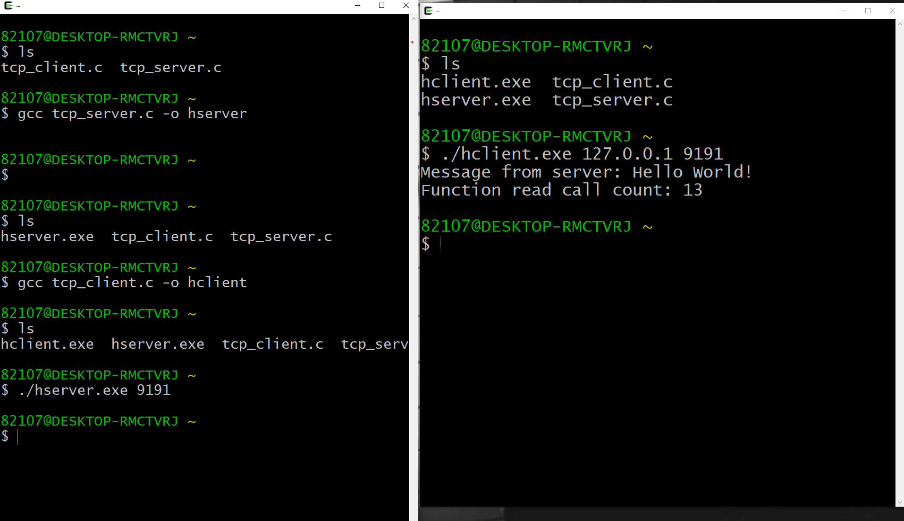

# MyFristRepository
## MyFristRepository

[네이버](https://naver.com)

   - 첫 번째
     - 두 번째
       - 세 번째
    
1. **볼드체**
2. __볼드체__
3. *이탤릭체*

>문단 모양이 된거죠.
>   

'''
코드 블럭 안
'''
* * *

</img>

##4주차과제
</img>

